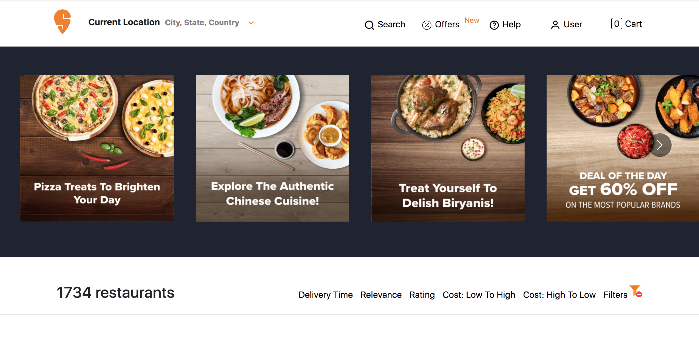
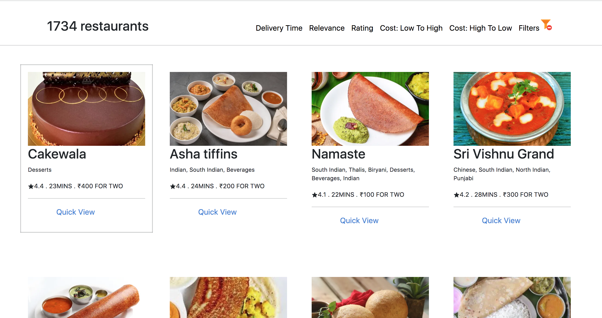

`Swiggy Clone`

`Challenges`

- Methods (Map , Filter)
- Carousel
- Cards 
- React Hooks 
- Cart 
- filter each Crads
- offcanvas
- API 
- Objects
- Array
- Event handling
- React Router 
- React Icons
- Bootstrap
- Css
- Responsive

`Pending challenge` `🤔`
- React Router ✅
  Install @reduxjs/toolkit & react redux 
  Build our own store & connect our store to our app
  Slice (cartslice)
  dispatch(action)
  Selector
- Responsive
- Dynamic Cart button✅
- filter each Cards✅
- filter Ratings and many more to complete

`Testing ` 
-Unit testing : test react component in isolation 
- intrigation testing
- end to end testing 

react testing library uses jest