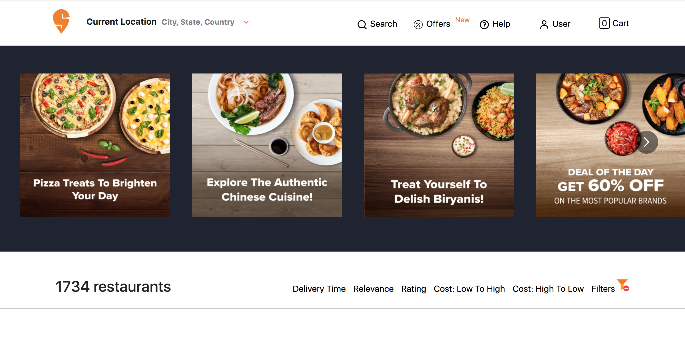
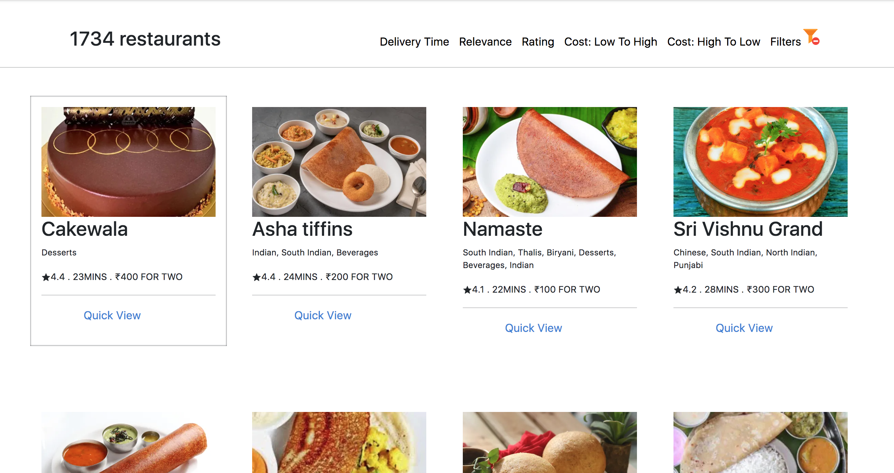

`Swiggy Clone`

`Challenges`

- Methods (Map , Filter)
- Carousel
- Cards 
- React Hooks 
- Cart 
- filter each Crads
- offcanvas
- API 
- Objects
- Array
- Event handling
- React Router 
- React Icons
- Bootstrap
- Css
- Responsive

`Pending challenge` `🤔`
- React Router 
- Responsive
- Dynamic Cart button
- filter each Cards
- filter Ratings and many more to complete
